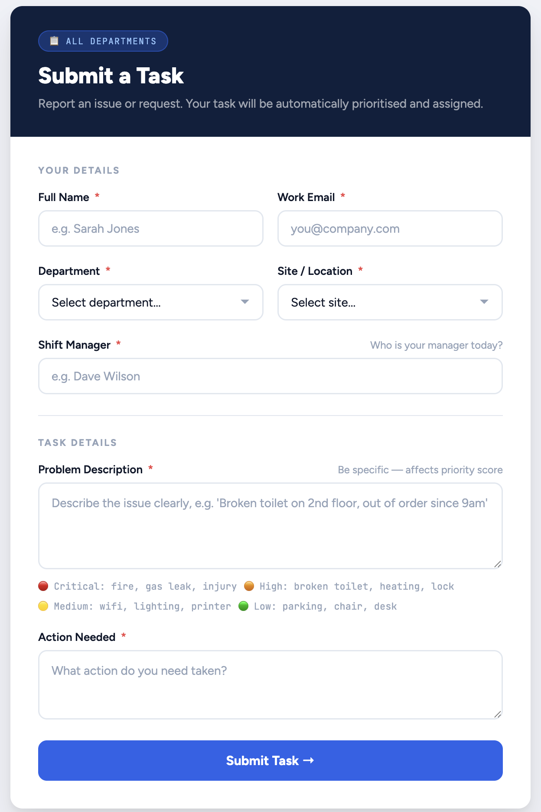
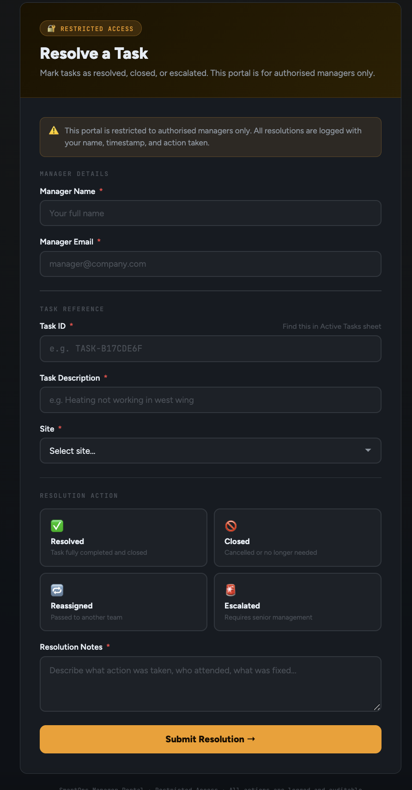
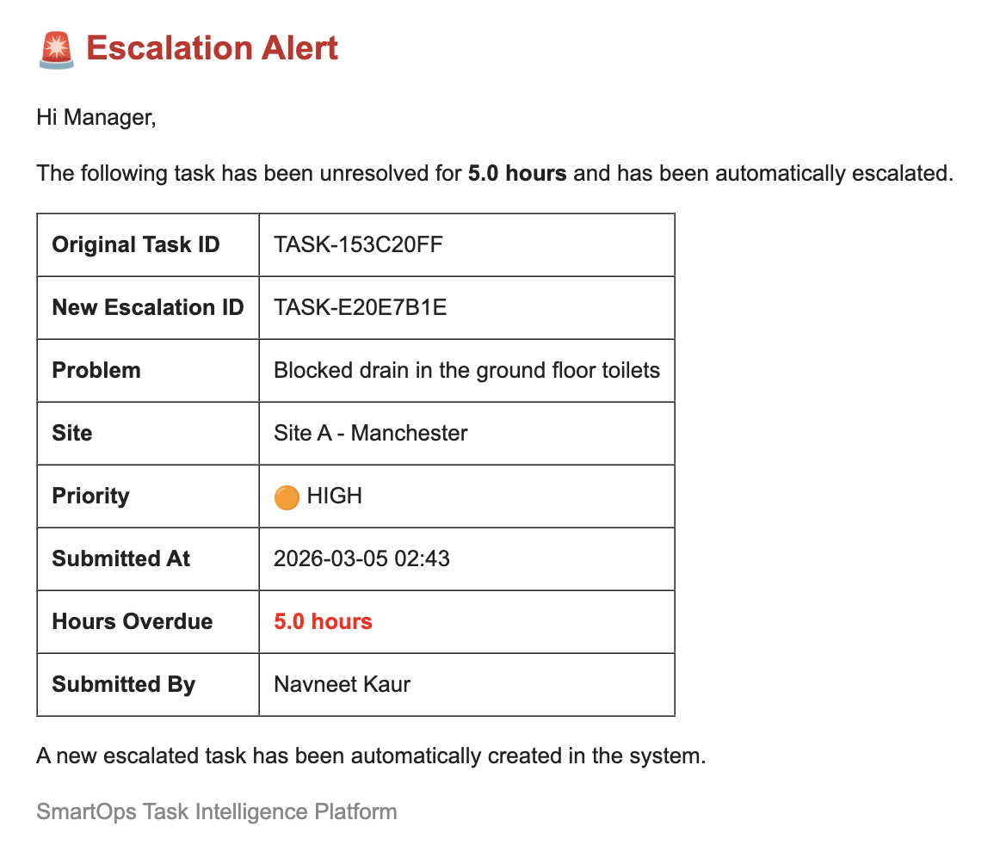
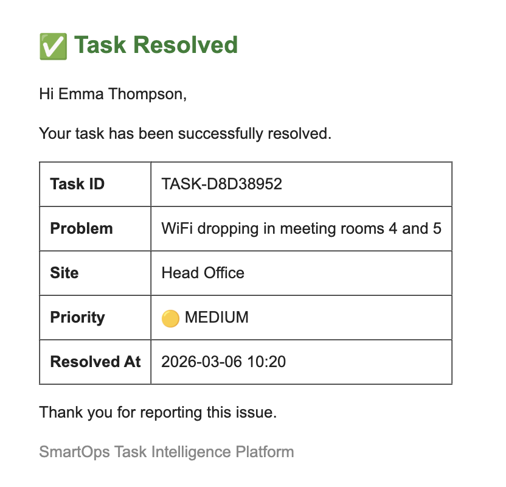
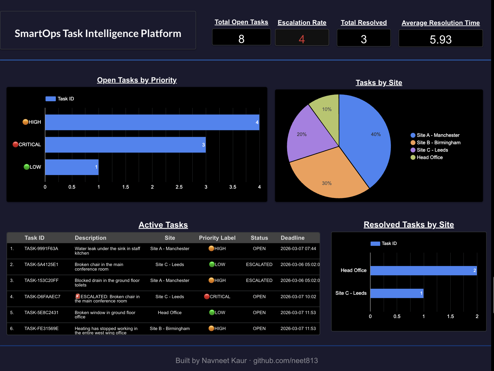

# SmartOps Task Intelligence Platform

**An automated facilities task management system built in Python — because broken things don't fix themselves.**

[](https://script.google.com/macros/s/AKfycbwHKLzSxfLbnHalrYSMb6rKrFOAFWFR5xf_O2r4gZPLvawWgrabMqKZ3a5m4VZIMNNW/exec)
[](https://script.google.com/macros/s/AKfycbwHKLzSxfLbnHalrYSMb6rKrFOAFWFR5xf_O2r4gZPLvawWgrabMqKZ3a5m4VZIMNNW/exec?page=resolve)
[](https://www.linkedin.com/in/navneet-kaur-analyst/)

---

## Why I Built This

Working in facilities and operations, I noticed something that most companies overlook — when something breaks, the reporting process is just as broken. Tasks get logged on paper, in WhatsApp messages, or not at all. Nothing gets prioritised. Nothing gets escalated. Managers find out about a gas leak the same way they find out about a missing chair.

Facilities management is just as critical to a business as sales and revenue. A broken heating system in January, a blocked drain, a faulty security keypad — these directly affect staff safety, productivity, and compliance. I built SmartOps to automate the entire workflow from submission to resolution, so nothing slips through the cracks.

---

## What It Does

SmartOps is a fully automated task management platform for multi-site facilities teams. Employees submit issues through a live web form. Python scores each task by priority, tracks deadlines, escalates anything overdue, archives resolved tasks, and sends email alerts — all without any manual input.

**The full workflow:**

```
Employee submits task via live form
         ↓
Python automatically scores priority (1–100)
         ↓
Task added to Active Tasks with 24hr deadline
         ↓
If unresolved after 24hrs → auto escalation + manager email alert
         ↓
Manager resolves via Manager Portal
         ↓
Task archived with resolution time + completion email sent
         ↓
Live dashboard updates automatically
```

---


## Impact
- 🚫 Zero tasks lost — overdue detection catches everything within 24hrs
- ⚡ Priority scoring eliminates manual triage — managers act on data, not guesswork
- 📊 Average resolution time tracked automatically across all sites
- 🔁 Recurring tasks save ~8 manual form submissions per month
- 📧 Automated email alerts mean zero missed escalations


---

## Live Demo

| | |
|---|---|
| 🟦 **Employee Form** | 



| 🟧 **Manager Portal** | 




---

## Features

**Priority Scoring Engine** — Every task is automatically scored 1–100 based on keywords in the description. A gas leak scores 100. A broken chair scores 15. The system uses this to rank tasks and colour-code the dashboard.

**Auto Escalation** — Any task unresolved after 24 hours is automatically escalated. A new CRITICAL task is created, the original is flagged, and the manager receives an email alert — no human input required.

**Email Notifications** — Two types of automated emails: escalation alerts to the manager when a task is overdue, and completion emails to the submitter when their task is resolved.

**Recurring Tasks** — The system auto-generates a weekly safety check every Monday and a monthly fire equipment inspection on the 1st of each month.

**Archive with Resolution Times** — Every resolved task is moved to an Archive tab with the exact resolution time in hours, creating a full audit trail.

**Live Dashboard** — A Looker Studio dashboard connected directly to Google Sheets shows open tasks by priority, tasks by site, escalation rate, and average resolution time — all in real time.

**Auto Scheduler** — The entire system runs on a 30-minute loop via Python threading. No manual triggering needed.


---


## Developer’s Logic Log: SmartOps Platform

I built this platform to move away from "WhatsApp-based" operations. Here is the architectural logic behind my decisions:

* **The "Deterministic" Scoring Engine:** I chose a keyword-weighting algorithm over an LLM for task triage. In facilities, you need **predictability**—a "Gas Leak" must *always* be a 100/100 priority. This approach is faster, 100% reliable, and costs $0 to run.
* **The 24-Hour "Escalation" Loop:** I designed the logic to mirror industry SLA (Service Level Agreement) standards. By comparing the `Current Time` against the `Submission Timestamp`, the script identifies "Stale" tasks and triggers a manager alert, ensuring total accountability.
* **Hybrid Infrastructure:** I used **Google Apps Script** for the front-end because it integrates natively with Google Sheets. I used **Python** for the back-end (Scoring, Logic, Emails) because it offers more robust scheduling and processing capabilities.
* **Automation for Compliance:** The "Recurring Task" module eliminates human error. By auto-generating fire safety and maintenance checks on a schedule, I ensured the platform acts as a safety net, not just a logbook.


---

## Email Alerts in Action

**Escalation Alert (sent automatically after 24hrs):**


**Task Resolved Confirmation:**



---


## Tech Stack

| Tool | Purpose |
|---|---|
| Python | Core automation logic |
| Google Colab | Hosted runtime environment |
| Google Sheets API (gspread) | Data storage across 4 tabs |
| Google Apps Script | Hosts live web forms, writes directly to Sheets |
| Gmail SMTP | Automated email notifications |
| Looker Studio | Live analytics dashboard |

---

## Google Sheet Structure

| Tab | Purpose |
|---|---|
| Form Submissions | Raw submissions from the web form |
| Active Tasks | All live tasks with priority, status, deadline |
| Archive | Resolved tasks with resolution times |
| Escalation Log | Full log of every escalation |

---

## Priority Scoring System

| Priority | Score | Examples |
|---|---|---|
| 🔴 CRITICAL | 90–100 | Gas leak, fire, injury, flooding |
| 🟠 HIGH | 70–89 | Broken toilet, no heating, security issue |
| 🟡 MEDIUM | 40–69 | WiFi down, broken light, printer offline |
| 🟢 LOW | 1–39 | Broken chair, parking issue, missing blind |

---

## How to Set Up Your Own

**1. Clone the repo**
```bash
git clone https://github.com/neet813/SmartOps-Task-Platform.git
```

**2. Create a Google Sheet** with these 4 tabs:
- Form Submissions
- Active Tasks
- Archive
- Escalation Log

**3. Set up a Google Cloud service account**
- Go to [console.cloud.google.com](https://console.cloud.google.com)
- Create a project → Enable Google Sheets API and Google Drive API
- Create a service account → Download the JSON credentials file
- Share your Google Sheet with the service account email

**4. Open the Colab notebook**
- Upload your JSON credentials file to Colab
- Update Cell 3 with your filename
- Update Cell 4 with your Gmail address and app password

**5. Run cells 1–8 in order**
- Cell 5 sets up headers (run once only)
- Cells 6–8 load all functions

**6. Run Cell 9 to start the scheduler**
- Keep the Colab tab open
- System runs automatically every 30 minutes

**7. Set up the web forms**
- Open [Google Apps Script](https://script.google.com)
- Create a new project and paste the form HTML files
- Deploy as a web app (Execute as: Me, Access: Anyone)

---

## Project Structure

```
SmartOps-Task-Platform/
│
├── smartops_notebook.ipynb   # Main Python notebook (9 cells)
├── README.md                 # This file
└── dashboard.png             # Screenshot of live dashboard
```

---

## Dashboard Preview



---

## Built By

**Navneet Kaur** — Data & Operations Analyst

Inspired by real frustrations working in multi-site facilities operations. Built solo from scratch using Python, Google Sheets API, and Google Apps Script.

[](https://www.linkedin.com/in/navneet-kaur-analyst/)
[](https://github.com/neet813)
